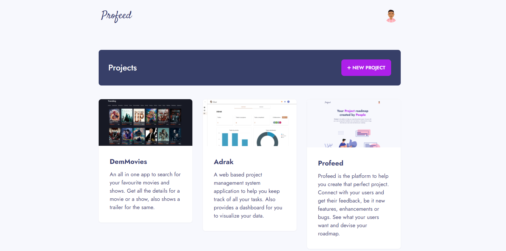
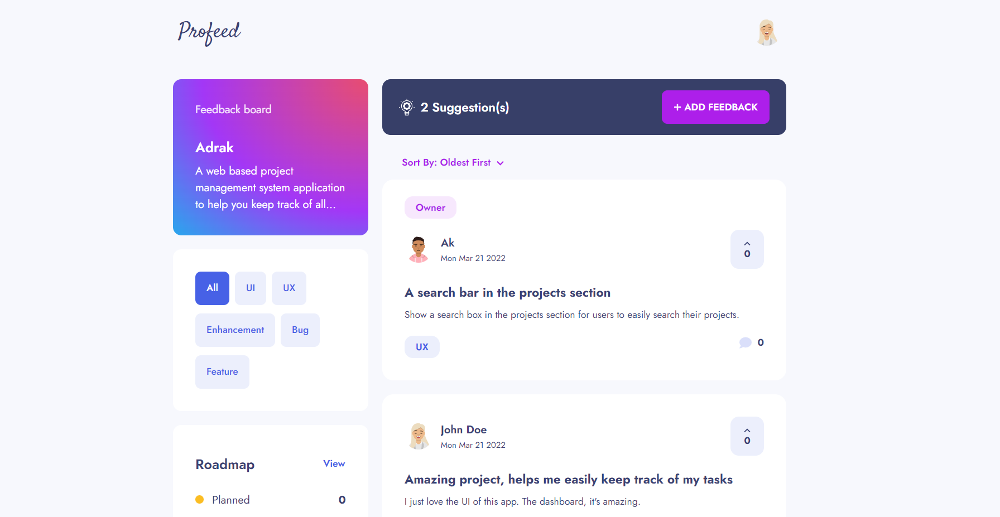
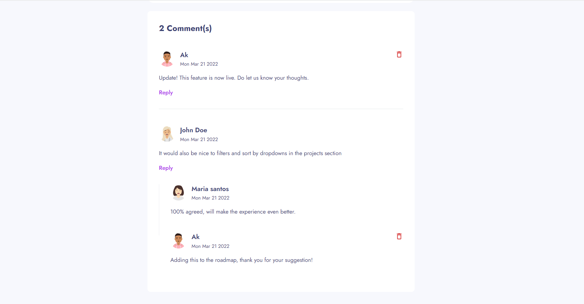
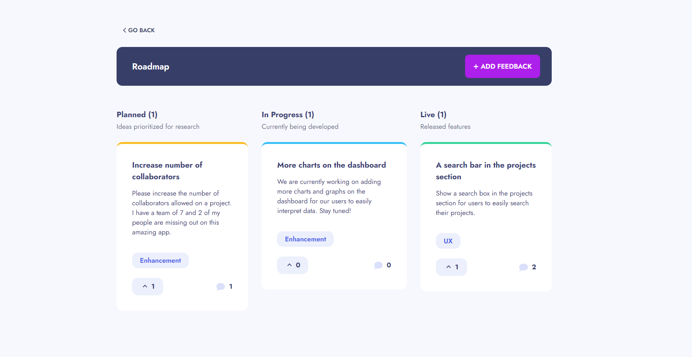

# Profeed

Profeed is a platform to share your projects and get feedback from it's users. Users can address bugs, new features, UI/UX changes etc. Project owners can then act accordingly and make changes to their product roadmap.
 

### Landing page

 
 

### See all projects on the platform

 
 

### Project details

 
 

### Interactive comments on each feedback

 
 

### Project roadmap

